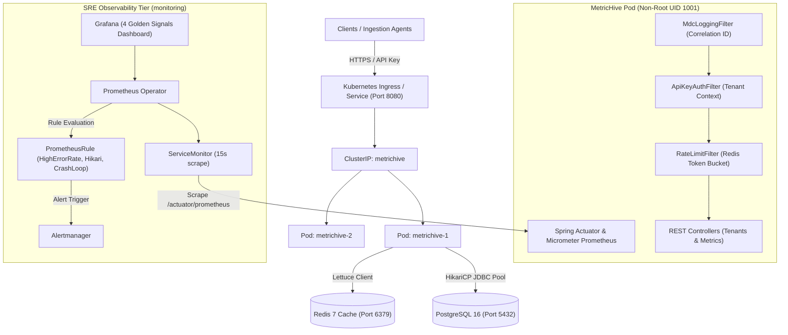

# MetricHive 🐝

[](https://github.com/HesandaLiyanage/MetricHive/actions/workflows/ci.yml)
[](https://openjdk.org/projects/jdk/21/)
[](https://spring.io/projects/spring-boot)
[](https://kubernetes.io/)
[](https://www.terraform.io/)
[](https://github.com/HesandaLiyanage/MetricHive/pkgs/container/metrichive)
[](LICENSE)

> **Production-Grade Multi-Tenant Metric Telemetry Ingestion Engine & SRE Observability Platform**  
> Built with Java 21 LTS, Spring Boot 4, Redis token-bucket rate limiting, PostgreSQL time-series persistence, Kubernetes zero-downtime rolling topologies, modular AWS Terraform IaC, and full Prometheus/Grafana SRE monitoring.

---

## 🏛️ System Architecture



---

## ✨ Key Features

* **High-Throughput Multi-Tenant Ingestion**: Dedicated REST endpoints for real-time single and batched telemetry events with tenant isolation.
* **Distributed Token-Bucket Rate Limiting**: Redis-backed rate limiting per tenant tier, preventing noisy neighbors and protecting database health.
* **Hardened Multi-Stage Containerization**: Minimal Alpine JRE runtime (219 MB layer content size), non-root execution (`appuser:appgroup` UID/GID 1001), and native healthchecks.
* **Production AWS Infrastructure (Terraform)**: Modular IaC featuring 3-AZ VPC, AWS Graviton (`db.t4g.micro`) Multi-AZ PostgreSQL RDS, immutable ECR repository, and least-privilege IAM policies.
* **Zero-Downtime Kubernetes Deployment**: Multi-replica topology in Kind with resource requests/limits, Horizontal Pod Autoscaling (HPA), and proven 43s rolling updates with 0s instant rollback.
* **SRE 4 Golden Signals Observability**: Out-of-the-box Prometheus Operator scraping, Alertmanager rules (5xx error rate, DB connection pool saturation, pod crash loops), and a custom Grafana dashboard.

---

## 🛠️ Technology Stack

| Layer | Technologies |
| :--- | :--- |
| **Language & Framework** | Java 21 LTS, Spring Boot 4.0.0-M2, Spring Security, Spring Data JPA, Micrometer |
| **Data & Caching** | PostgreSQL 16 (Relational/Telemetry), Redis 7 (Token Bucket Rate Limiting), HikariCP |
| **Container & Local Cluster** | Docker (Alpine Multi-Stage), Docker Compose, Kind (Kubernetes in Docker v0.33.0 / K8s v1.31), Helm |
| **Cloud Infrastructure (IaC)** | HashiCorp Terraform (~> 5.0), AWS VPC, AWS RDS (Graviton ARM64), AWS ECR, AWS IAM |
| **CI/CD & DevSecOps** | GitHub Actions (6-stage pipeline), Maven Checkstyle (Google Java Style), Aqua Trivy |
| **Observability & SRE** | Prometheus Operator (`kube-prometheus-stack`), Grafana, Alertmanager, SRE Runbooks |

---

## 🚀 Quickstart Guide

### Option A: Local Development with Docker Compose

Spin up the entire application stack including PostgreSQL and Redis with automated health checks:

```bash
# Clone the repository
git clone https://github.com/HesandaLiyanage/MetricHive.git
cd MetricHive

# Start multi-container stack in detached mode
docker compose up -d

# Verify all services are healthy
docker compose ps

# Check application health
curl -s http://localhost:8080/actuator/health | jq .
```

### Option B: Local Kubernetes Cluster with Observability (Kind + Helm)

Deploy the production Kubernetes topology and Prometheus monitoring stack locally:

```bash
# 1. Create a Kind Kubernetes cluster
kind create cluster --name metrichive

# 2. Build and load the Docker image into Kind
docker build -t metrichive:local .
kind load docker-image metrichive:local --name metrichive

# 3. Apply Kubernetes workloads & stateful dependencies
kubectl apply -f k8s/secret.yaml
kubectl apply -f k8s/postgres.yaml
kubectl apply -f k8s/redis.yaml
kubectl apply -f k8s/deployment.yaml
kubectl apply -f k8s/service.yaml
kubectl apply -f k8s/hpa.yaml

# 4. Install Prometheus Operator & Grafana via Helm
helm repo add prometheus-community https://prometheus-community.github.io/helm-charts
helm repo update
helm install prometheus prometheus-community/kube-prometheus-stack --namespace monitoring --create-namespace

# 5. Apply ServiceMonitor and Alert Rules
kubectl apply -f k8s/servicemonitor.yaml
kubectl apply -f k8s/alert-rules.yaml
```

---

## 📡 API Reference

### 1. Register a Tenant
```http
POST /api/v1/tenants
Content-Type: application/json

{
  "name": "Acme Analytics",
  "email": "dev@acme.com",
  "plan": "ENTERPRISE"
}
```
**Response (HTTP 201 Created):**
```json
{
  "id": 1,
  "name": "Acme Analytics",
  "email": "dev@acme.com",
  "api_key": "mh_live_9f83a04bc612...",
  "tier": "free",
  "max_requests_per_minute": 60
}
```

### 2. Ingest a Telemetry Metric
```http
POST /api/v1/metrics
Content-Type: application/json
X-API-Key: mh_live_9f83a04bc612...

{
  "name": "system.cpu.utilization",
  "value": 78.45,
  "tags": {
    "host": "prod-worker-01",
    "region": "us-east-1"
  }
}
```
**Response (HTTP 201 Created):**
```json
{
  "id": 101,
  "tenant_id": 1,
  "metric_name": "system.cpu.utilization",
  "value": 78.45,
  "timestamp": "2026-09-21T01:30:00Z"
}
```

### 3. Query Ingested Metrics
```http
GET /api/v1/metrics/query?name=system.cpu.utilization&limit=50
X-API-Key: mh_live_9f83a04bc612...
```

### 4. SRE & Health Endpoints
* **Actuator Health**: `GET /actuator/health` (Reports overall and subsystem status: DB, Redis, Disk).
* **Prometheus Metrics**: `GET /actuator/prometheus` (Exposes Micrometer metrics scraped by Prometheus).

---

## 🔒 CI/CD & DevSecOps Pipeline

MetricHive enforces quality, security, and immutability across every pull request and push to `main` via a **6-stage GitHub Actions pipeline** ([`.github/workflows/ci.yml`](.github/workflows/ci.yml)):

```
┌──────────────┐     ┌──────────────┐     ┌──────────────────┐
│ 1. Checkstyle│ ──> │ 2. JUnit Test│ ──> │ 3. Trivy FS Scan │
│ (0 violations)│    │ (24/24 pass) │     │ (0 critical CVE) │
└──────────────┘     └──────────────┘     └──────────────────┘
                            │
                            ▼
┌──────────────┐     ┌──────────────┐     ┌──────────────────┐
│ 4. Build Img │ ──> │ 5. Trivy Img │ ──> │ 6. Publish GHCR  │
│ (Alpine JRE) │     │ (0 critical) │     │ (main branch only│
└──────────────┘     └──────────────┘     └──────────────────┘
```

1. **Lint (Checkstyle)**: Enforces Google Java Style compliance (0 violations permitted).
2. **Test (Surefire)**: Runs complete integration test suite with isolated H2 / Testcontainers.
3. **Security (Filesystem Scan)**: Scans codebase for secret leaks and library CVEs.
4. **Build (Docker)**: Multi-stage Alpine container compilation.
5. **Security (Image Scan)**: Scans built container artifact for OS vulnerabilities.
6. **Push (GHCR)**: Automatically publishes multi-tagged container images upon merge to `main`.

---

## 📈 Observability & The 4 Golden Signals

The system includes pre-built configurations for Google SRE's **4 Golden Signals** in [`k8s/grafana-dashboard.json`](k8s/grafana-dashboard.json):

* **Latency**: p95 and p99 response time histograms derived from `http_server_requests_seconds_bucket`.
* **Traffic**: Real-time requests per second segmented by endpoint URI.
* **Errors**: 5xx error percentage and distribution against total traffic.
* **Saturation**: JVM heap utilization %, HikariCP active database connections vs pool capacity, and per-pod CPU usage.

### Automated Alerting Rules ([`k8s/alert-rules.yaml`](k8s/alert-rules.yaml))
* `HighErrorRate` (Critical): 5xx error rate > 5% over 5-minute rolling window for 2 minutes.
* `DatabaseConnectionPoolExhaustion` (Warning): Active database connections > 80% of pool capacity for 2 minutes.
* `PodCrashLooping` (Critical): Container restart rate > 0.5/minute for 2 minutes.

---

## 📚 Documentation & Reference Guides

* **[RUNBOOK.md](RUNBOOK.md)**: Production SRE incident response manual for on-call engineers. Covers 2 AM step-by-step diagnostic workflows, database deadlocks, rollbacks, and recovery procedures.
* **[ref.md](ref.md)**: Exhaustive engineering guide covering all architecture decisions, problems encountered, workarounds applied, and 30-second live interview demonstration scripts.
* **[CONTRIBUTING.md](CONTRIBUTING.md)**: Contribution guidelines, code standards, and PR process.

---

## 📄 License

This project is licensed under the MIT License — see the [LICENSE](LICENSE) file for details.
