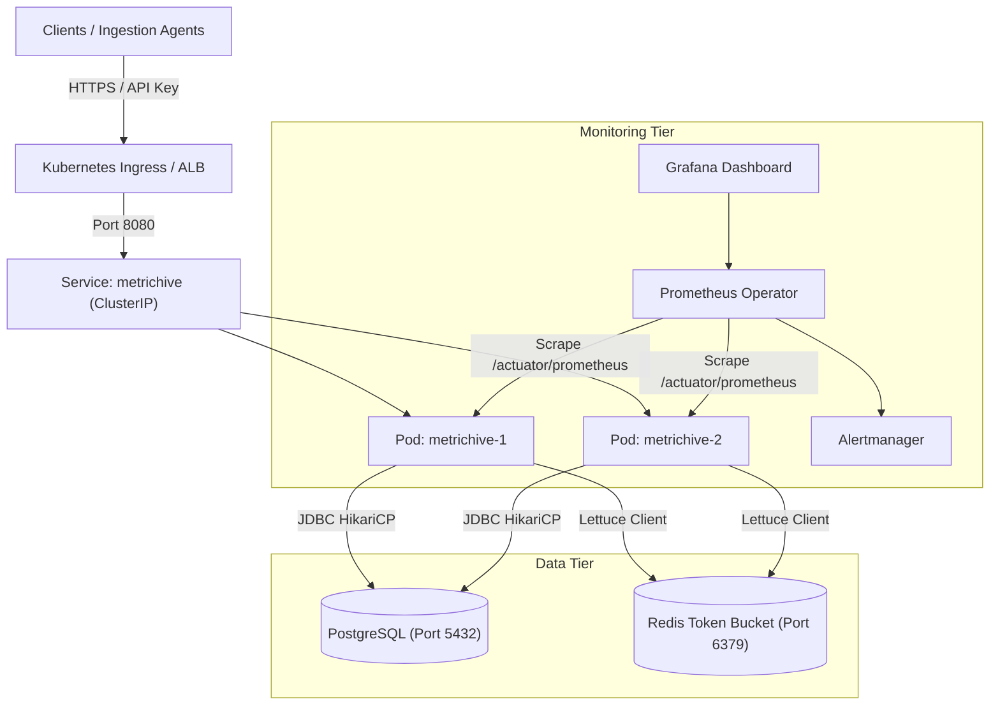

# MetricHive On-Call Incident Response Runbook

> **Audience:** On-Call SREs & DevOps Engineers  
> **Service Tier:** Tier 1 (Critical Multi-Tenant Metric Telemetry Service)  
> **SLO:** 99.9% Availability, p99 Latency < 250ms, Error Budget 5xx < 0.1%

---

## Section 1: Service Overview & Architecture Diagram

MetricHive is a high-throughput, multi-tenant metric ingestion and time-series query service built with Spring Boot 4 and Java 21 LTS. It ingests batched telemetry events, validates rate limits via Redis token buckets, persists metrics in PostgreSQL, and exports operational metrics via Micrometer and Spring Boot Actuator.

### System Architecture



---

## Section 2: Alert: HighErrorRate

### Symptoms
- Prometheus alert `HighErrorRate` firing.
- HTTP 5xx responses exceed 5% of total requests over a 5-minute rolling window.
- Ingestion pipelines reporting failed deliveries.

### Diagnosis (Step-by-Step at 2 AM)

1. **Verify active pods and restart counts:**
   ```bash
   kubectl get pods -l app=metrichive -o wide
   ```

2. **Check recent application error logs across all pods:**
   ```bash
   kubectl logs -l app=metrichive --tail=200 --prefix=true | grep -E "ERROR|Exception"
   ```

3. **Inspect error status codes breakdown via Actuator/Prometheus:**
   ```bash
   # Port-forward service to local machine
   kubectl port-forward svc/metrichive 8080:8080 &
   PF_PID=$!
   
   # Query prometheus metrics
   curl -s http://localhost:8080/actuator/prometheus | grep -E 'http_server_requests_seconds_count\{.*status="5'
   
   kill $PF_PID
   ```

4. **Verify downstream database and cache connectivity:**
   ```bash
   curl -s http://localhost:8080/actuator/health | jq .
   ```

### Mitigation

- **If errors are caused by a bad deployment / regression:**
  Roll back immediately to the last known healthy revision:
  ```bash
  kubectl rollout undo deployment/metrichive
  kubectl rollout status deployment/metrichive
  ```

- **If errors are caused by temporary traffic spikes:**
  Immediately scale up the deployment:
  ```bash
  kubectl scale deployment/metrichive --replicas=5
  ```

- **If PostgreSQL is unresponsive:**
  Check DB pod status and restart if deadlocked:
  ```bash
  kubectl get pods -l app=postgres
  kubectl rollout restart deployment/postgres
  ```

### Escalation
If error rate remains above 5% after rollback and scaling:
1. Page Secondary On-Call / Lead Backend Engineer.
2. Divert upstream ingestion traffic if dead-letter queue is active.
3. Open Incident Bridge: `#incident-metrichive`.

---

## Section 3: Alert: PodCrashLooping

### Symptoms
- Pod state transitions to `CrashLoopBackOff` or `Error`.
- Readiness probe fails repeatedly; available replicas drop below 2.

### Diagnosis

1. **Identify crashing pod and exit code:**
   ```bash
   kubectl get pods -l app=metrichive
   ```

2. **Inspect pod termination reason and events:**
   ```bash
   kubectl describe pod <CRASHING_POD_NAME>
   ```

3. **Check previous container logs before termination:**
   ```bash
   kubectl logs <CRASHING_POD_NAME> --previous --tail=100
   ```

4. **Check for OOMKilled (Out of Memory):**
   ```bash
   kubectl get pod <CRASHING_POD_NAME> -o jsonpath='{.status.containerStatuses[0].lastState.terminated.reason}'
   ```

### Mitigation

- **If OOMKilled:** Temporarily increase memory limits on the deployment:
  ```bash
  kubectl set resources deployment/metrichive --limits=memory=2048Mi --requests=memory=1024Mi
  ```

- **If bad image or invalid configuration:**
  Roll back to the previous deployment revision:
  ```bash
  kubectl rollout undo deployment/metrichive
  ```

- **If missing secrets:** Verify that `metrichive-secret` exists and contains required keys:
  ```bash
  kubectl get secret metrichive-secret -o yaml
  ```

---

## Section 4: Alert: DatabaseConnectionPoolExhausted

### Symptoms
- Requests failing with `CannotGetJdbcConnectionException` or `ConnectionTimeoutException`.
- Latency spikes on POST `/api/v1/metrics` and GET `/api/v1/metrics/query`.
- Actuator health check reports `db.status = DOWN`.

### Diagnosis

1. **Inspect HikariCP connection pool metrics:**
   ```bash
   # Query pool status directly from actuator
   curl -s http://localhost:8080/actuator/metrics/hikaricp.connections.active
   curl -s http://localhost:8080/actuator/metrics/hikaricp.connections.pending
   curl -s http://localhost:8080/actuator/metrics/hikaricp.connections.timeout.total
   ```

2. **Check active database connections inside PostgreSQL:**
   ```bash
   kubectl exec -it deployment/postgres -- psql -U metrichive -d metrichive_dev -c "SELECT count(*), state FROM pg_stat_activity GROUP BY state;"
   ```

3. **Identify long-running blocking queries:**
   ```bash
   kubectl exec -it deployment/postgres -- psql -U metrichive -d metrichive_dev -c "SELECT pid, now() - query_start AS duration, query FROM pg_stat_activity WHERE state != 'idle' ORDER BY duration DESC LIMIT 5;"
   ```

### Mitigation

- **Kill long-running orphaned locks:**
  ```bash
  kubectl exec -it deployment/postgres -- psql -U metrichive -d metrichive_dev -c "SELECT pg_terminate_backend(pid) FROM pg_stat_activity WHERE duration > interval '2 minutes' AND state != 'idle';"
  ```

- **Increase Hikari pool maximum size:**
  Update the connection pool configuration or restart the pods to release stuck pool connections:
  ```bash
  kubectl rollout restart deployment/metrichive
  ```

---

## Section 5: Common Operational Tasks

### 1. Scale Deployment
```bash
# Manual scaling
kubectl scale deployment/metrichive --replicas=4

# Inspect Horizontal Pod Autoscaler status
kubectl get hpa metrichive-hpa
```

### 2. Port-Forward for Local Troubleshooting
```bash
# Application Actuator & API (port 8080)
kubectl port-forward svc/metrichive 8080:8080

# Prometheus UI (port 9090)
kubectl port-forward -n monitoring svc/prometheus-kube-prometheus-prometheus 9090:9090

# Grafana UI (port 3000, default login admin / admin)
kubectl port-forward -n monitoring svc/prometheus-grafana 3000:80
```

### 3. View Live Service Metrics
```bash
# Query Actuator Prometheus endpoint directly
curl -s http://localhost:8080/actuator/prometheus | grep "application=\"metrichive\""

# View CPU / Memory utilization
kubectl top pods -l app=metrichive
```

### 4. Restart Application Pods Gracefully
```bash
kubectl rollout restart deployment/metrichive
kubectl rollout status deployment/metrichive
```
