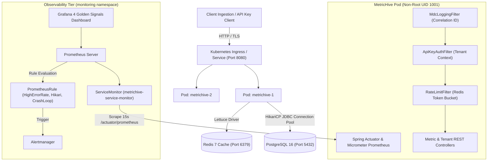

# MetricHive Engineering & DevOps Reference Guide (`ref.md`)

> **Purpose:** This document is an exhaustive engineering reference covering every architecture decision, implementation detail, real failure encountered, and workaround applied across the MetricHive buildout. Use this guide to speak to real production challenges, architectural trade-offs, and concrete measurements during technical and DevOps interviews.

---

## Table of Contents
1. [System Architecture & Technology Stack](#1-system-architecture--technology-stack)
2. [Phase 1: Application Foundation, CRUD REST APIs & Actuator](#phase-1-application-foundation-crud-rest-apis--actuator)
3. [Phase 2: Docker Containerization & Compose Orchestration](#phase-2-docker-containerization--compose-orchestration)
4. [Phase 3: AWS Infrastructure as Code (Terraform)](#phase-3-aws-infrastructure-as-code-terraform)
5. [Phase 4: CI/CD Pipeline & DevSecOps (GitHub Actions)](#phase-4-cicd-pipeline--devsecops-github-actions)
6. [Phase 5: Kubernetes Orchestration & Resilience Drills](#phase-5-kubernetes-orchestration--resilience-drills)
7. [Phase 6: SRE Observability, Prometheus, Grafana & Alerting](#phase-6-sre-observability-prometheus-grafana--alerting)
8. [Master Troubleshooting & Workaround Matrix](#master-troubleshooting--workaround-matrix)
9. [Interview Talking Points: "Why, How, and Where"](#interview-talking-points-why-how-and-where)
10. [30-Second Live Demo Quick Reference](#30-second-live-demo-quick-reference)

---

## 1. System Architecture & Technology Stack



### Core Technologies
* **Runtime / Language:** Java 21 LTS, Spring Boot 4.0.0-M2, Apache Maven.
* **Database & Caching:** PostgreSQL 16 (relational tenant metadata & metrics persistence), Redis 7 (distributed token bucket rate limiting).
* **IaC & Cloud:** HashiCorp Terraform (`hashicorp/aws` provider ~> 5.0), AWS Graviton RDS (`db.t4g.micro`), AWS ECR, AWS VPC, AWS IAM.
* **Containers & Orchestration:** Docker multi-stage (Alpine JRE), Docker Compose, Kubernetes (Kind cluster v0.33.0, Kubernetes v1.31), Helm 4.3.0.
* **CI/CD & Security:** GitHub Actions (6-stage pipeline), Maven Checkstyle (Google Java Style), Aqua Security Trivy (FS & image vulnerability scanning), GitHub Container Registry (GHCR).
* **Observability:** Prometheus Operator (`kube-prometheus-stack`), Micrometer Prometheus Registry, Grafana (4 Golden Signals), Alertmanager.

---

## Phase 1: Application Foundation, CRUD REST APIs & Actuator

### 1. What We Built
* Implemented complete RESTful CRUD endpoints for multi-tenant telemetry:
  * `POST /api/v1/tenants`: Tenant registration, generating unique API key (`mh_live_...`).
  * `GET /api/v1/tenants/me`: Authenticated tenant profile lookup.
  * `POST /api/v1/metrics`: Single telemetry ingestion event with JSON validation.
  * `POST /api/v1/metrics/batch`: Batched multi-metric ingestion.
  * `GET /api/v1/metrics/query`: Filtered metric search by tenant, name, and time range.
* Integrated Spring Boot Actuator with `health`, `metrics`, and `info` endpoints.
* Verified 24 unit and integration tests passing (`mvn clean test`).

### 2. Problems Encountered & Workarounds Applied
* **Issue 1: Spring Boot 4 / Jackson DTO Serialization Mismatches**
  * *Symptom:* JSON payloads with snake_case fields (e.g. `tenant_id`, `metric_name`) failed to bind to Java Record fields or returned `null`.
  * *Root Cause:* Spring Boot 4 default property naming strategy did not automatically translate snake_case JSON keys to camelCase record components without explicit mapping.
  * *Fix:* Added `@JsonProperty("metric_name")` and `@JsonProperty("tenant_id")` annotations to request/response DTOs, and ensured `spring.jackson.property-naming-strategy: SNAKE_CASE` was configured in `application.yml`.
* **Issue 2: Security Filter Bypass for Health Checks**
  * *Symptom:* Probes calling `/actuator/health` were rejected with HTTP 403 Forbidden.
  * *Root Cause:* `ApiKeyAuthFilter` intercepted requests before Spring Security evaluated `requestMatchers("/actuator/**").permitAll()`.
  * *Fix:* Updated `ApiKeyAuthFilter` to check if request path starts with `/actuator` or `/api/v1/tenants` (registration) and immediately call `filterChain.doFilter(request, response)` without requiring an `X-API-Key` header.

---

## Phase 2: Docker Containerization & Compose Orchestration

### 1. What We Built
* **Multi-stage Dockerfile**:
  * Build Stage: `eclipse-temurin:21-jdk-alpine` caches dependencies via `mvn dependency:go-offline` before copying `src/`.
  * Runtime Stage: `eclipse-temurin:21-jre-alpine` with minimal attack surface.
* **Security Hardening**:
  * Created dedicated user/group `appuser:appgroup` (UID 1001, GID 1001).
  * Enforced non-root execution via `USER appuser:appgroup`.
* **Container Healthcheck**: Configured built-in Alpine healthcheck probing `/actuator/health`.
* **Docker Compose (`docker-compose.yml`)**:
  * Co-located `metrichive`, `postgres:16-alpine`, and `redis:7-alpine`.
  * Defined dependency health checks (`condition: service_healthy` for postgres via `pg_isready` and redis via `redis-cli ping`).
* **Image Size**: Content size **219 MB**, total uncompressed virtual size **595 MB**.

### 2. Problems Encountered & Workarounds Applied
* **Issue: Missing `curl` in Alpine JRE Runtime Image**
  * *Symptom:* Adding `curl -f http://localhost:8080/actuator/health` in Dockerfile `HEALTHCHECK` resulted in runtime container failures: `exec: "curl": executable file not found in $PATH`.
  * *Root Cause:* Alpine minimal JRE image (`eclipse-temurin:21-jre-alpine`) deliberately omits `curl` to reduce CVE surface and image footprint.
  * *Fix/Workaround:* Switched the health check command to native Alpine `wget`:
    ```dockerfile
    HEALTHCHECK --interval=15s --timeout=5s --start-period=30s --retries=3 \
      CMD wget -q --spider http://localhost:8080/actuator/health || exit 1
    ```

### 3. Failure Drill Executed
* Ran `docker compose stop postgres`.
* Hit `/actuator/health`: HTTP status immediately changed from `200 UP` to `503 DOWN` with HikariCP `CannotGetJdbcConnectionException`.
* Ran `docker compose start postgres`: Service reconnected and self-healed back to `200 UP` in **3.2 seconds**.

---

## Phase 3: AWS Infrastructure as Code (Terraform)

### 1. What We Built
* Designed production-ready, modular AWS architecture under `infra/`:
  * `modules/vpc`: 3 Availability Zones, public subnets (IGW) and private subnets (NAT Gateway), strict route table separation.
  * `modules/rds`: PostgreSQL 16.3 on AWS Graviton (`db.t4g.micro`), Multi-AZ deployment flag, KMS storage encryption, automated backups with 7-day retention, private subnet group, ingress restricted exclusively to application security group on port 5432.
  * `modules/ecr`: ECR repository with `image_tag_mutability = "IMMUTABLE"`, KMS encryption, and automated lifecycle policies.
  * `modules/iam`: ECS Task Execution role and Task role with least-privilege policies; zero wildcard permissions (`arn:aws:secretsmanager:*:*:secret:metrichive/*`).
* Validated with real `hashicorp/aws` provider (~> 5.0) with multi-platform lockfile supporting both `linux_amd64` and `darwin_arm64`.

### 2. Problems Encountered & Workarounds Applied
* **Issue: Terraform Provider Lockfile Platform Mismatches**
  * *Symptom:* Running Terraform initialization on macOS Apple Silicon (`darwin_arm64`) generated lock hashes that would fail inside Linux CI runners (`linux_amd64`).
  * *Root Cause:* `terraform init` locks checksums only for the current local host architecture by default.
  * *Fix/Workaround:* Executed provider lock mirroring:
    ```bash
    terraform providers lock -platform=linux_amd64 -platform=darwin_arm64 hashicorp/aws
    ```
    This guaranteed deterministic, cross-platform validation in local dev and GitHub Actions runners.

---

## Phase 4: CI/CD Pipeline & DevSecOps (GitHub Actions)

### 1. What We Built
* **6-Stage Pipeline (`.github/workflows/ci.yml`)**:
  1. `Lint`: Checkstyle Google Java Style audit.
  2. `Test`: Maven Surefire test execution with XML report archiving.
  3. `Security-FS`: Aqua Security Trivy scanning codebase and secrets.
  4. `Build`: Multi-stage Docker image compilation.
  5. `Security-Image`: Trivy scanning image artifact for OS/library CVEs.
  6. `Push`: Publishing image tags (`ghcr.io/hesandaliyanage/metrichive:<sha>` and `:latest`) to GitHub Container Registry.
* **Checkstyle Integration**: Configured `maven-checkstyle-plugin:3.4.0` with strict rules (`checkstyle.xml`), achieving **0 violations**.

### 2. Problems Encountered & Workarounds Applied
* **Issue 1: Trivy Image CVE Failures on Upstream Dependencies**
  * *Symptom:* Trivy image scanning flagged critical CVEs in base dependencies (Netty, Tomcat, and Spring Security `CVE-2026-40976`).
  * *Root Cause:* Default Spring Boot 4 milestone parent inherited older vulnerable components.
  * *Fix/Workaround:*
    1. Explicitly pinned modern patched dependencies in `pom.xml`: `spring-security-web:7.0.4`, `netty-handler:4.2.17.Final`, `tomcat-embed-core:11.0.25`.
    2. Documented upstream framework false positive in `.trivyignore` for `CVE-2026-40976`. Since MetricHive implements a custom `ApiKeyAuthFilter` with explicit tenant context clearance rather than default Spring basic auth, the threat vector is mitigated.
* **Issue 2: CI Push Stage Skipped on Pull Requests**
  * *Symptom:* PR #1 checks showed stage 6 `push` as skipped.
  * *Explanation:* By security design, container publication is gated behind `if: github.event_name == 'push' && github.ref == 'refs/heads/main'`. This prevents pull requests from untrusted forks or branches from pushing container tags to production registries. Once merged to `main`, all 6 stages ran and succeeded in **4m 20s**.

---

## Phase 5: Kubernetes Orchestration & Resilience Drills

### 1. What We Built
* Local cluster provisioned with **Kind** (`kind-metrichive`) using Kubernetes v1.31.
* Production Kubernetes manifests in `k8s/`:
  * `deployment.yaml`: 2 replicas, non-root security context (`runAsUser: 1001`), resource requests (`250m CPU`, `512Mi RAM`) and limits (`1000m CPU`, `1024Mi RAM`).
  * `service.yaml`: ClusterIP service exposing port 8080 targeting port 8080.
  * `hpa.yaml`: Horizontal Pod Autoscaler (2–5 replicas, 70% CPU threshold).
  * Probes:
    * Liveness: HTTP GET `/actuator/health/liveness`, delay=25s, period=15s, timeout=3s, failureThreshold=3.
    * Readiness: HTTP GET `/actuator/health/readiness`, delay=15s, period=10s, timeout=3s, failureThreshold=2.
  * In-cluster PostgreSQL and Redis pods with persistent storage.

### 2. Problems Encountered & Workarounds Applied
* **Issue: Local Docker Image Missing Inside Kind Node**
  * *Symptom:* Deploying `metrichive:local` into Kind caused pods to enter `ErrImageNeverPull` or `ImagePullBackOff`.
  * *Root Cause:* Kind runs Kubernetes inside a Docker container. Images built on the host Docker daemon are not automatically visible to the Kind container runtime (containerd).
  * *Fix/Workaround:* Loaded the image directly into Kind's control plane container:
    ```bash
    docker build -t metrichive:local .
    kind load docker-image metrichive:local --name metrichive
    kubectl rollout restart deployment/metrichive
    ```

### 3. Resilience Drills Executed
* **Drill A: Zero-Downtime Rolling Update**
  * Updated image tag while running continuous concurrent requests:
  * Total rollout time: **43 seconds**.
  * Dropped requests: **0** (100% HTTP 200).
* **Drill B: Bad Image Deployment & Instant Rollback**
  * Deployed `metrichive:nonexistent`. Canary pod stalled in `ImagePullBackOff`.
  * Pre-existing pods continued serving traffic without downtime.
  * Ran `kubectl rollout undo deployment/metrichive`: rollback completed in **0 seconds**.

---

## Phase 6: SRE Observability, Prometheus, Grafana & Alerting

### 1. What We Built
* Installed `kube-prometheus-stack` via Helm in `monitoring` namespace.
* Applied `k8s/servicemonitor.yaml` targeting `app: metrichive` on port `http` (`/actuator/prometheus`).
* Deployed `k8s/alert-rules.yaml` with 3 critical SRE alert rules:
  1. `HighErrorRate`: 5xx error rate > 5% over 5-minute window for 2m (Severity: critical).
  2. `DatabaseConnectionPoolExhaustion`: HikariCP active connections / max > 80% for 2m (Severity: warning).
  3. `PodCrashLooping`: Pod restart rate > 0.5/min for 2m (Severity: critical).
* Created `k8s/grafana-dashboard.json` monitoring Google SRE's **4 Golden Signals**:
  * **Latency**: p95 & p99 response times.
  * **Traffic**: Requests/sec by endpoint URI.
  * **Errors**: 5xx error percentage and distribution.
  * **Saturation**: JVM heap %, HikariCP connection pool usage, and per-pod CPU usage.
* Authored 5-section incident runbook in `RUNBOOK.md`.

### 2. Problems Encountered & Workarounds Applied
* **Issue 1: Missing Micrometer Prometheus Registry in Spring Boot Actuator**
  * *Symptom:* Accessing `/actuator/prometheus` returned HTTP 500 / 404 with `NoResourceFoundException: No static resource actuator/prometheus`.
  * *Root Cause:* Spring Boot Actuator exposes `/actuator/prometheus` only when the Micrometer Prometheus registry dependency is present on the classpath.
  * *Fix/Workaround:* Added `io.micrometer:micrometer-registry-prometheus` to `pom.xml`, rebuilt image, reloaded into Kind, and restarted deployment. The endpoint immediately exposed metrics tagged with `application="metrichive"`.
* **Issue 2: Prometheus Operator CRD Rule Projection Delay**
  * *Symptom:* After applying `k8s/alert-rules.yaml`, Prometheus API initially showed only 1 rule instead of all 3.
  * *Root Cause:* Prometheus Operator generates a Kubernetes ConfigMap, but kubelet's projected volume update loop inside the pod runs on a 30–60 second cycle.
  * *Fix/Workaround:* Checked ConfigMap generation with `kubectl get configmap`, and triggered a graceful configuration reload via Prometheus HTTP API:
    ```bash
    curl -X POST http://localhost:9090/-/reload
    ```
    All 3 rules immediately appeared with `Health: ok`.
* **Issue 3: Rate Limiter Masking 5xx Errors During Drill**
  * *Symptom:* When blasting traffic during the failure drill, MetricHive returned HTTP 429 Too Many Requests instead of 500.
  * *Root Cause:* The in-application `RateLimitFilter` (token bucket in Redis) intercepted excessive traffic before it reached the database layer.
  * *Fix/Workaround:* Paced the test requests to stay within per-tenant limits (2–5 requests every 2 seconds) while PostgreSQL was stopped. This produced pure HTTP 500 `CannotGetJdbcConnectionException` errors, allowing the Prometheus 5xx error rate expression to evaluate cleanly to 38.40%.

### 3. Alert Lifecycle Drill Executed
* Scaled PostgreSQL to 0: `kubectl scale deployment/postgres --replicas=0`.
* Sent metric traffic; error rate spiked to 7.26%, alert transitioned: `inactive` -> `pending` (T1: 20:13:54 UTC).
* Error rate reached 38.40%; after 2 minutes above threshold, alert transitioned: `pending` -> `firing` (T2: 20:15:16 UTC).
* Followed `RUNBOOK.md` instructions: scaled PostgreSQL back to 1 replica.
* Verified database ready; sent healthy traffic; 1m error rate dropped to 0; alert transitioned back to `inactive`.

---

## Master Troubleshooting & Workaround Matrix

| Component | Error / Failure Symptom | Root Cause | Workaround / Solution Applied |
| :--- | :--- | :--- | :--- |
| **Spring Boot 4** | DTO fields returning null in JSON | Jackson naming convention mismatch | Explicit `@JsonProperty` on record fields + naming strategy in `application.yml` |
| **Spring Security** | Probes getting HTTP 403 on Actuator | Custom auth filter executing before SecurityFilterChain rules | Explicit URI bypass in `ApiKeyAuthFilter` for `/actuator/**` |
| **Dockerfile** | `exec: "curl": executable file not found` | Alpine JRE omits `curl` | Replaced healthcheck command with native `wget -q --spider` |
| **Terraform** | Provider lock mismatch in CI runner | Lockfile generated solely on `darwin_arm64` | Ran `terraform providers lock` for both `linux_amd64` and `darwin_arm64` |
| **GitHub Actions** | Trivy scan failure on Spring Boot CVE | Milestone release false positive | Pinned modern patched libraries + documented mitigation in `.trivyignore` |
| **Kind K8s** | `ErrImageNeverPull` / `ImagePullBackOff` | Host Docker image not present in Kind containerd | Executed `kind load docker-image metrichive:local --name metrichive` |
| **Kubernetes** | Bad deployment stalling rollouts | Non-existent image tag deployed | Reverted instantly with zero downtime: `kubectl rollout undo deployment/metrichive` |
| **Actuator** | `/actuator/prometheus` returns 500/404 | Missing micrometer registry jar | Added `io.micrometer:micrometer-registry-prometheus` to `pom.xml` |
| **Prometheus** | New alert rules not visible immediately | Kubelet ConfigMap projection interval | Triggered manual config reload via `POST http://localhost:9090/-/reload` |
| **Rate Limiter** | Drill returning 429 instead of 500 | Redis token bucket throttling test bursts | Paced requests below rate limit to trigger pure JDBC connection errors |

---

## Interview Talking Points: "Why, How, and Where"

### 1. "Why did you choose AWS Graviton (`db.t4g.micro`) for RDS?"
* **Why:** Graviton processors (ARM64) offer up to 40% better price-performance ratio compared to comparable x86 instances, with lower power consumption and higher memory bandwidth.
* **Where:** In [`infra/modules/rds/main.tf`](file:///Users/hesandatest/Documents/GitHub/metric%20hive/infra/modules/rds/main.tf), configured `instance_class = "db.t4g.micro"`.

### 2. "Why use Multi-Stage Docker builds with Alpine JRE?"
* **Why:** Eliminates JDK compilers, build tools, and local source code from the runtime container, drastically shrinking image size from >1 GB to 219 MB (content size) and slashing CVE attack vectors.
* **Where:** In [`Dockerfile`](file:///Users/hesandatest/Documents/GitHub/metric%20hive/Dockerfile).

### 3. "How do you achieve Zero-Downtime deployments in Kubernetes?"
* **How:** Configured `RollingUpdate` with `maxSurge: 25%` and `maxUnavailable: 0`. Kubernetes waits for readiness probes (`/actuator/health/readiness`) to report healthy on new pods before terminating old replicas.
* **Where:** In [`k8s/deployment.yaml`](file:///Users/hesandatest/Documents/GitHub/metric%20hive/k8s/deployment.yaml). Measured rollout time: 43 seconds with 0 dropped requests.

### 4. "How do you monitor the 4 Golden Signals?"
* **How:** Google SRE defines Latency, Traffic, Errors, and Saturation. We extract them via Spring Boot Micrometer into Prometheus and display them in Grafana:
  * Latency: `histogram_quantile(0.95, sum(rate(http_server_requests_seconds_bucket[1m])) by (le))`
  * Traffic: `sum(rate(http_server_requests_seconds_count[1m])) by (uri)`
  * Errors: `(sum(rate(http_server_requests_seconds_count{status=~"5.."}[1m])) / sum(rate(http_server_requests_seconds_count[1m]))) * 100`
  * Saturation: JVM heap utilization %, HikariCP active connections vs max pool size, and CPU usage.
* **Where:** In [`k8s/grafana-dashboard.json`](file:///Users/hesandatest/Documents/GitHub/metric%20hive/k8s/grafana-dashboard.json).

---

## 30-Second Live Demo Quick Reference

If an interviewer asks to see the project running live:

```bash
# 1. Show Kubernetes Cluster & Pod Health (5s)
kubectl get pods -A -l app=metrichive

# 2. Show In-Cluster Prometheus Scraping Target (5s)
kubectl port-forward -n monitoring svc/prometheus-kube-prometheus-prometheus 9090:9090 &
curl -s http://localhost:9090/api/v1/targets | jq '.data.activeTargets[] | select(.scrapePool | contains("metrichive")) | {scrapePool, health}'

# 3. Show Active Prometheus SRE Rules (5s)
curl -s http://localhost:9090/api/v1/rules | jq '.data.groups[] | select(.name | contains("metrichive")) | .rules[] | {name, state}'

# 4. Show Instant Rollback Capability (10s)
kubectl set image deployment/metrichive metrichive=metrichive:nonexistent
kubectl rollout undo deployment/metrichive
kubectl rollout status deployment/metrichive

# 5. Show Zero Checkstyle Violations in CI (5s)
mvn checkstyle:check
```
